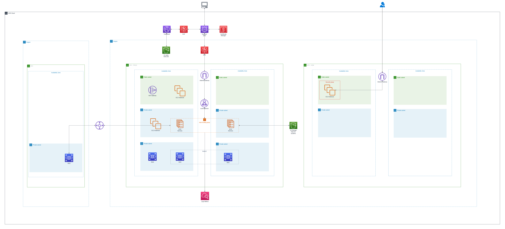

# aws-architecture-case-study
Case study de arquitetura em AWS cobrindo migração, escalabilidade, segurança e entrega de aplicações.

Este projeto apresenta a reestruturação de uma infraestrutura corporativa na Amazon Web Services (AWS) com o objetivo de otimizar desempenho, disponibilidade, segurança e escalabilidade do ecossistema de sistemas da organização.

O ambiente anterior estava centralizado em um servidor virtual único, o que resultava em diversos desafios críticos relacionados a escalabilidade, alta disponibilidade e resiliência. A seguir, são detalhados os principais problemas identificados e as soluções adotadas.

### Armazenamento

A infraestrutura anterior enfrentava limitações severas de espaço devido ao volume contínuo de dados gerados pelos sistemas. Em períodos de atualização intensiva, a capacidade insuficiente para armazenar grandes quantidades de dados e realizar backups era um problema crítico.  

Para resolver isso, os dados foram migrados para o **Amazon Simple Storage Service (S3)**, que oferece armazenamento escalável e resiliente. O S3 garante alta disponibilidade e segurança por meio de replicação em múltiplas zonas de disponibilidade, eliminando os gargalos anteriores e assegurando políticas de backup eficazes.

### Computação

Para a camada de serviços, foi adotado o **Elastic Container Service (ECS)**. Essa escolha permitiu aproveitar a escalabilidade automática e a flexibilidade do serviço, ajustando-se conforme a demanda e reduzindo a necessidade de gerenciamento manual de servidores.

### Banco de Dados

O banco de dados em servidor dedicado foi substituído pelo **Amazon Relational Database Service (RDS)**. Esse serviço gerenciado simplifica a administração, permitindo que a AWS cuide de manutenção, atualizações e gerenciamento da infraestrutura subjacente.  

O RDS facilita a escalabilidade de capacidade, oferece alta disponibilidade com failover automático e realiza backups automatizados, garantindo segurança e confiabilidade.

### Entrega de Conteúdo com CloudFront

Para otimizar a distribuição de aplicativos web, foi implementado o **Amazon CloudFront**. Esse serviço de CDN distribui conteúdo estático e dinâmico por meio de uma rede global de pontos de presença, garantindo menor latência e melhor experiência para os usuários.  

Além de acelerar a entrega, o CloudFront adiciona camadas de segurança, como proteção contra ataques e suporte a HTTPS.

### Segurança

A arquitetura foi projetada considerando as práticas recomendadas da AWS para segurança. Isso incluiu:  

- Uso de controles de acesso granulares  
- Monitoramento contínuo  
- Auditoria centralizada  

A infraestrutura resultante assegura a proteção e a integridade dos dados, alinhando-se a padrões de conformidade e boas práticas de mercado.

### Migração, DevOps e Suporte

Durante a migração, foi essencial oferecer suporte à equipe de desenvolvimento em múltiplas frentes:  

- Orientação sobre uso do SDK da AWS  
- Criação de pipelines de integração e entrega contínuas (CI/CD)  
- Suporte técnico para adoção dos serviços  
- Apoio na elaboração de estimativas de custos e planejamento da nova infraestrutura  

Essa abordagem garantiu que a solução fosse eficiente, escalável e economicamente viável.
